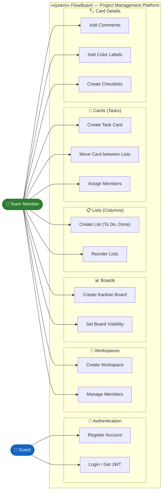
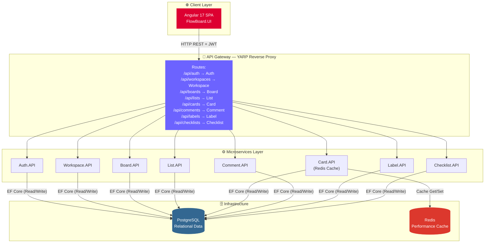
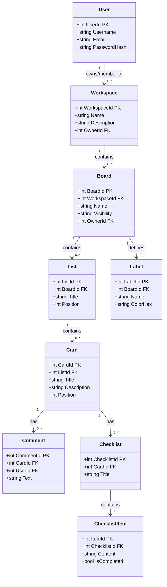
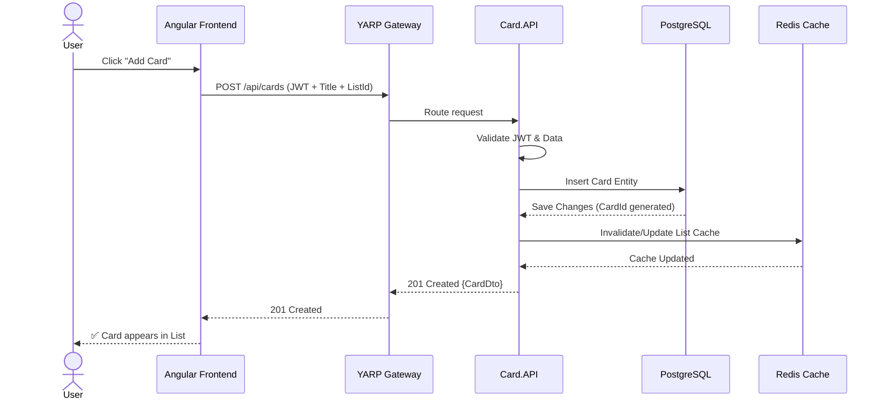
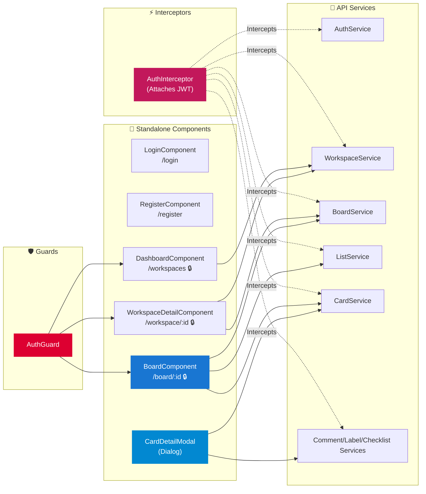
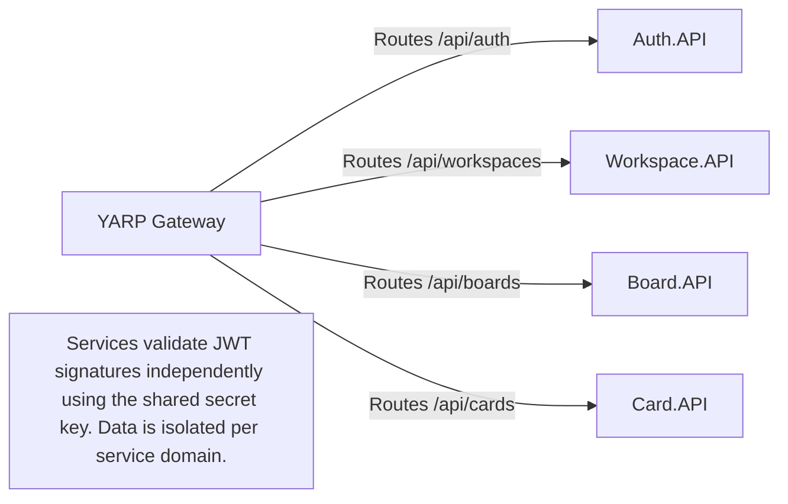

<div align="center">


# FlowBoard

### A Production-Grade Project Management Platform Built on Microservices

[](https://dotnet.microsoft.com/)
[](https://angular.dev/)
[](https://www.postgresql.org/)
[](https://redis.io/)
[](https://www.docker.com/)
[](LICENSE)

<p>FlowBoard is a modern, scalable project management and collaboration platform (Trello-clone) engineered with a full microservices architecture. It enables users to create workspaces, manage Kanban boards, collaborate on tasks, and organize work at scale.</p>

[Architecture](#-system-architecture) · [Microservices](#-microservices-overview) · [API Docs](#-api-reference) · [Setup](#-getting-started)

---

</div>

## 📌 Table of Contents

- [Tech Stack](#-tech-stack)
- [Architecture Overview](#-system-architecture)
- [UML Diagrams](#-uml-diagrams)
  - [Use Case Diagram](#1-use-case-diagram)
  - [System Architecture](#2-system-architecture-diagram)
  - [Entity Class Diagram](#3-entity-class-diagram)
  - [Task Creation Sequence](#4-task-card-creation-flow)
  - [Angular Component Diagram](#5-angular-frontend-component-diagram)
  - [Inter-Service Communication](#6-inter-service-communication-map)
- [Microservices Overview](#-microservices-overview)
- [Core Features](#-core-features)
- [Database Schema](#-database-schema)
- [API Reference](#-api-reference)
- [Infrastructure](#-infrastructure)
- [Design Patterns](#-key-design-patterns)
- [Getting Started](#-getting-started)
- [Roadmap](#-roadmap)

---

## 🛠 Tech Stack

| Layer | Technology | Purpose |
|-------|------------|---------|
| **Backend** | ASP.NET Core 8 Web API | 8 independent microservices |
| **Frontend** | Angular 17 | Standalone components, Single-page application |
| **Database** | PostgreSQL 16 | Relational data storage with Code-first migrations |
| **ORM** | Entity Framework Core | Database access and modeling |
| **Cache** | Redis | Caching for performance (e.g., Cards/Tasks) |
| **Auth** | JWT (HS256) | Stateless authentication |
| **Gateway** | YARP Reverse Proxy | Single entry point, API routing |
| **Containerization** | Docker & Docker Compose | Local orchestration |
| **Deployment** | Render.com | Cloud production environment |

---

## 🏗 System Architecture

FlowBoard follows a strict **Microservices Architecture** with these core principles:

| Pattern | Applied Where |
|---------|--------------|
| ✅ **Microservices** | 8 independently deployable domain-driven services |
| ✅ **API Gateway** | Single YARP entry point for all frontend traffic |
| ✅ **Repository Pattern** | Clean separation of data access in every microservice |
| ✅ **Service Layer** | Business logic encapsulated within dedicated services |
| ✅ **Distributed Cache** | Redis used for fast retrieval of high-traffic items |
| ✅ **DTO Pattern** | Separate request/response models from database entities |
| ✅ **Standalone Frontend** | Modern Angular architecture without NgModules |

---

## 📐 UML Diagrams

### 1. Use Case Diagram

> All actors and use cases across every module of FlowBoard



---

### 2. System Architecture Diagram

> Full deployment view — Client → API Gateway → Microservices → Infrastructure



---

### 3. Entity Class Diagram

> Domain model mapping the core hierarchical structure of FlowBoard



---

### 4. Task (Card) Creation Flow

> Sequence diagram — How a card is created and cached



---

### 5. Angular Frontend Component Diagram

> Standalone component architecture and routing



---

### 6. Inter-Service Communication Map

> In FlowBoard, services are highly decoupled. Most communication is orchestrated by the client or Gateway, but services share standard JWT validation.



---

## 📦 Microservices Overview

| Service | Responsibility | Port (Local) |
|---------|----------------|:------------:|
| **Auth.API** | User registration, authentication, JWT generation | 5001 |
| **Workspace.API** | Workspace creation, member management | 5002 |
| **Board.API** | Board creation, visibility, workspace linkage | 5003 |
| **List.API** | Kanban columns (To Do, In Progress, etc.) | 5004 |
| **Card.API** | Tasks, positioning, descriptions, Redis caching | 5005 |
| **Comment.API** | User discussions on specific cards | 5006 |
| **Label.API** | Color-coded tags for organization | 5007 |
| **Checklist.API** | Sub-tasks and completion tracking | 5008 |
| **Gateway** | YARP Reverse proxy routing all traffic | 5000 |

---

## 🎯 Core Features

- **Authentication:** Secure JWT-based login and registration.
- **Hierarchical Organization:** Workspaces -> Boards -> Lists -> Cards.
- **Real-time feel (Kanban):** Manage tasks dynamically across lists.
- **Deep Collaboration:** Add comments to tasks to keep the team updated.
- **Task Granularity:** Break down large cards using Checklists.
- **Visual Organization:** Apply custom colored Labels to cards.
- **Performance:** Redis caching implemented for heavy-read operations.
- **Cloud-Ready:** Fully containerized and configured for platforms like Render.

---

## 🗄 Database Schema

FlowBoard utilizes **PostgreSQL** with Entity Framework Core migrations. While in development a shared database instance can be used, the schema logically isolates tables per microservice context:

- `Users`
- `Workspaces`, `WorkspaceMembers`
- `Boards`, `BoardMembers`
- `Lists`
- `Cards`
- `Comments`
- `Labels`, `CardLabels`
- `Checklists`, `ChecklistItems`

---

## 🌐 API Reference

*(All endpoints prefixed with Gateway URL, e.g., `https://flowboard-gateway.onrender.com`)*

**Auth**
- `POST /api/auth/register`
- `POST /api/auth/login`

**Workspaces**
- `GET /api/workspaces/my`
- `POST /api/workspaces`
- `GET /api/workspaces/{id}`

**Boards**
- `GET /api/boards/workspace/{workspaceId}`
- `POST /api/boards`
- `GET /api/boards/{id}`

**Lists & Cards**
- `GET /api/lists/board/{boardId}`
- `POST /api/lists`
- `GET /api/cards/list/{listId}`
- `POST /api/cards`

**Details (Comments, Labels, Checklists)**
- `GET /api/comments/card/{cardId}`
- `GET /api/labels/board/{boardId}`
- `GET /api/checklists/card/{cardId}`

*(All protected routes require `Authorization: Bearer <token>` header)*

---

## 🔧 Infrastructure

### YARP API Gateway
- Centralized entry point on port 5000 (or 8080 in production).
- Configured via `appsettings.json` to route `/api/boards/{**catch-all}` to the Board service, etc.

### Redis Cache
- Integrated into the **Card.API**.
- Speeds up retrieval of cards within busy lists.

### Containerization
- Each of the 8 microservices, plus the gateway, contains a `Dockerfile`.
- `docker-compose.yml` orchestrates the entire backend, spinning up Postgres, Redis, and all .NET APIs simultaneously.

---

## 📊 Key Design Patterns

| Pattern | Implementation |
|---------|----------------|
| **Repository Pattern** | Abstracts EF Core database operations (e.g., `IBoardRepository`). |
| **Service Layer** | Contains business logic, separated from Controllers. |
| **DTOs & AutoMapper** | Prevents over-posting and formats data for the client. |
| **Reverse Proxy** | YARP handles external traffic and forwards to internal services. |
| **Standalone Components**| Modern Angular approach, removing the need for `NgModules`. |

---

## 🚀 Getting Started

### Prerequisites

- [.NET 8 SDK](https://dotnet.microsoft.com/download)
- [Node.js 20+](https://nodejs.org/) (for Angular)
- [Docker Desktop](https://www.docker.com/products/docker-desktop)

### Running with Docker Compose (Recommended)

1. Clone the repository.
2. Navigate to the backend root directory.
3. Start the infrastructure and microservices:
   ```bash
   docker-compose up --build -d
   ```
4. Apply database migrations (if not auto-applied by startup scripts).
5. The API Gateway will be available at `http://localhost:5000`.

### Running the Frontend

1. Navigate to the `flowboard-frontend` directory.
2. Install dependencies:
   ```bash
   npm install
   ```
3. Start the development server:
   ```bash
   npm start
   ```
4. Access the UI at `http://localhost:4200`.

---

## 🗺 Roadmap

- [x] Base Microservices Architecture setup
- [x] JWT Authentication & User Management
- [x] Workspaces, Boards, Lists, and Cards CRUD
- [x] Redis Caching implementation
- [x] Angular Standalone UI Integration
- [x] Cloud Deployment (Render.com)
- [x] SonarQube Local Code Analysis
- [ ] Drag and Drop Card reordering in UI
- [ ] Real-time updates via SignalR
- [ ] Email notifications for assigned tasks

---

<div align="center">
Made with ❤️ · FlowBoard — Microservices Project Management
</div>
